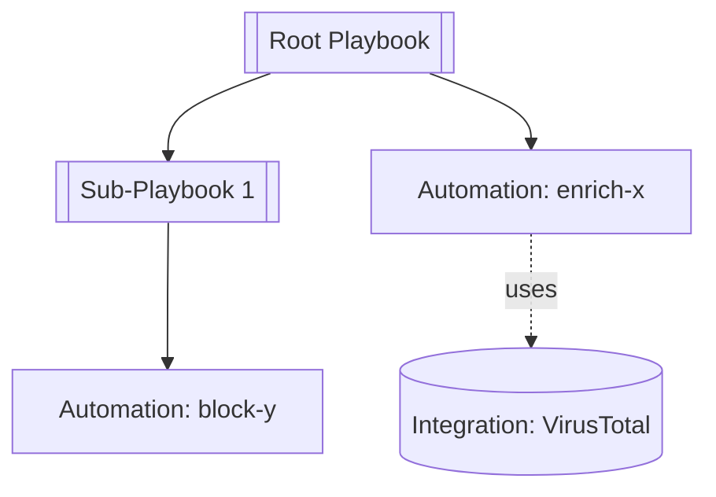

## Purpose

Documenting a playbook in isolation loses context. Sub-playbook behavior, automation error handling, and integration command details all affect how the root workflow actually operates. This skill produces a **linked document set** covering a playbook's entire dependency tree so the reader can navigate between components and so shared components are documented once and referenced from every consumer.

## When to Invoke

Trigger on: "workflow documentation", "full workflow", "comprehensive", "entire workflow", "document everything", "document the whole thing", "dependency tree", "document the workflow".

If the user asks for a single playbook, use `xsoar-playbook-documentation` instead. When in doubt, ask.

## Prerequisites

A manifest must exist at `investigation/docs/<sanitized-root-name>/manifest.json`, produced by:

```
python scripts/python/fetch-workflow.py --name "<root playbook name>"
```

The script recursively fetches every playbook in the tree, every referenced automation, and every referenced integration (credentials stripped), then writes the manifest. If the manifest is absent, run the fetch script first.

## Output Structure

```
investigation/docs/<root-sanitized>/
├── README.md                     # Workflow overview — entry point
├── manifest.json                 # Produced by fetch-workflow.py
├── playbooks/
│   ├── <root>.md                 # Full deep-dive per xsoar-playbook-documentation
│   └── <sub-playbook>.md         # One per playbook in the tree
├── automations/
│   └── <automation>.md           # One per referenced automation
└── integrations/
    └── <integration>.md          # One per referenced integration
```

All filenames use the same `sanitize_filename()` convention the fetch script uses (lowercase, hyphens, alphanumeric only) so cross-references are deterministic.

## Generation Order

Generate bottom-up so every link points to a file that already exists:

1. **Read `manifest.json`** — plan the work from the inventory.
2. **Integrations** — leaf dependencies, no outbound refs to other docs in the set.
3. **Automations** — may reference integrations.
4. **Per-playbook docs** — bottom-up (leaf sub-playbooks first, then callers). Apply the `xsoar-playbook-documentation` full deep-dive template to each, with cross-reference links layered in per the rules below.
5. **`README.md`** last — needs links to everything else.

## Per-Playbook Doc Additions

On top of the standard `xsoar-playbook-documentation` full deep-dive template:

- **Breadcrumb at top**: `← [Workflow Overview](../README.md)`
- **Sub-Playbooks table**: replace bare sub-playbook names with `[Name](./<sanitized>.md)`. If the sub-playbook is not in the manifest, render as bold text with `(not documented — external or builtin)`.
- **Integration Dependencies table**: link to `../integrations/<sanitized>.md`
- **Automations referenced in Task Reference**: link to `../automations/<sanitized>.md`
- **Executive Summary is not used at workflow scope** — every playbook gets the full deep-dive. If the user wants a summary for one playbook in the tree, they can request it separately with the single-playbook skill.

## Workflow Overview Template (`README.md`)

```markdown
# Workflow Documentation: <root playbook name>

Generated: <date> · Root: <name> · Version: <v>
Components: <N> playbooks · <N> automations · <N> integrations

## Table of Contents
- [Purpose](#purpose)
- [Full Dependency Diagram](#full-dependency-diagram)
- [Components](#components)
  - [Playbooks](#playbooks)
  - [Automations](#automations)
  - [Integrations](#integrations)
- [Execution Summary](#execution-summary)
- [Cross-Reference Index](#cross-reference-index)

## Purpose
<2–4 sentences synthesizing the root playbook's description and the role of the main sub-playbooks. Explain the workflow's overall job, not each component.>

## Full Dependency Diagram

This is a **dependency graph**, not an execution flow. Execution flow lives in each playbook's own doc.



### Diagram conventions
- Playbooks → double-bordered rectangles `[[...]]`
- Automations → plain rectangles `[...]`
- Integrations → cylinder `[(...)]`
- Solid arrow → direct invocation
- Dashed arrow `-.uses.->` → integration command use

## Components

### Playbooks
| Playbook | Role | Called By | Doc |
|----------|------|-----------|-----|
| Root Name | Entry point | — | [full doc](./playbooks/root.md) |
| Sub 1 | <role inferred from caller task name/description> | Root | [full doc](./playbooks/sub1.md) |

### Automations
| Automation | Used By | Doc |
|------------|---------|-----|
| enrich-x | Root, Sub 1 | [full doc](./automations/enrich-x.md) |

### Integrations
| Integration | Commands (in this workflow) | Used By | Doc |
|-------------|----------------------------|---------|-----|
| VirusTotal | vt-file-scan, vt-url-scan | 3 playbooks | [full doc](./integrations/virustotal.md) |

## Execution Summary
<3–6 sentences walking the reader through what happens when the root playbook runs, naming key decisions and sub-playbook handoffs with inline links to each component's doc.>

## Cross-Reference Index

**Shared components (used in ≥2 playbooks):**
- [enrich-x](./automations/enrich-x.md) — used by Root, Sub 1, Sub 2

**Error-tolerant tasks across the tree** (`continueonerror: true`):
- Root → Task 8 (Enrich Indicator)
- Sub 1 → Task 3 (Block URL)

**Manual tasks across the tree** (require human action):
- Root → Task 12 (Analyst Review)
```

## Automation Doc Template

```markdown
# Automation: <name>

← [Workflow Overview](../README.md)

- **Type:** <javascript | python | powershell>
- **Docker image:** <image>
- **Tags:** <tags>
- **Used by:** [Playbook 1](../playbooks/p1.md), [Playbook 2](../playbooks/p2.md)

## Purpose
<From the `comment` field; if empty, infer from name + arguments and note as inferred.>

## Arguments
| Name | Type | Required | Default | Description |
|------|------|----------|---------|-------------|

## Outputs
| Context Path | Type | Description |
|--------------|------|-------------|

## Dependencies
- Integrations invoked: <links to ../integrations/*.md>
- External commands called: <list, with notes>

## Behavior Notes
- Error handling: <any try/except or explicit error paths observed in the script>
- Context mutation: <whether it writes to context, reads from context, both>
```

## Integration Doc Template

```markdown
# Integration: <brand>

← [Workflow Overview](../README.md)

- **Name:** <display name>
- **Version:** <version>
- **Category:** <category>
- **Docker image:** <image>
- **Used by:** <N> playbooks, <N> automations

### Consumers
- Playbooks: [P1](../playbooks/p1.md), [P2](../playbooks/p2.md)
- Automations: [A1](../automations/a1.md)

## Commands Used in This Workflow
| Command | Called From | Purpose |
|---------|-------------|---------|
| vt-file-scan | Root → Task 5 | File hash enrichment |

## Full Command Inventory
<Bulleted list of every command the integration exposes, from the fetched JSON's `commands` array. Include one-line description.>

## Configuration Parameters
<Table of configuration parameters from the fetched JSON. Credentials are already redacted by the fetch script — do not re-expose redacted fields.>

| Parameter | Type | Required | Description |
|-----------|------|----------|-------------|
```

## Cross-Reference Link Rules

- All inter-document links are **relative** (`./`, `../`) so the folder is portable (zip, upload, share).
- Filenames use `sanitize_filename(name)` — match the fetch script exactly.
- Components **not in manifest** (e.g., Builtin operations, external playbooks not fetched) render as **bold text** with `(not documented — builtin/external)`, not as a broken link.
- Broken links are not acceptable output. Before finishing, scan generated docs and verify every `.md` link resolves to a file in the output folder.

## Dependency Diagram Generation

From the manifest:

1. Start with `graph TD`.
2. Node per playbook from `manifest.playbooks` — double-bordered.
3. Node per automation from `manifest.automations` — plain rectangle.
4. Node per integration from `manifest.integrations` — cylinder.
5. Edges:
   - For each playbook: edge to each of its `sub_playbooks`, `automations`, `integrations`.
   - For each automation: if the automation's fetched JSON shows it uses integration commands (check for `dependsOn` or parsed script content), draw dashed edges to those integrations.
6. Keep labels short (use names, not IDs). Confluence-rendered mermaid fails on long labels.
7. If total nodes > 40, group by layer: `subgraph Playbooks ... end`, `subgraph Automations ... end`, `subgraph Integrations ... end`.

## Special Cases

- **Components missing from manifest** (e.g., `fetch-workflow.py` couldn't find them): still list them in the components tables with status "not fetched — missing from manifest". Do not link.
- **Credential-stripped fields**: integration config may show `[REDACTED]` or `[REDACTED - hidden field]`. Include those rows in the config table with the redacted marker — do not omit them, since their existence is part of the integration's shape.
- **Large trees (50+ components)**: the README components tables can get long. Add a note at the top: "This workflow has N components. Use the TOC or Ctrl-F." Do not truncate tables.
- **Cycles**: fetch-workflow.py handles cycles via visited-set. If a playbook appears as its own descendant in the manifest `parents` arrays, note it in the Cross-Reference Index under a "Circular references" subheading.

## Data Security

Same rules as the other XSOAR skills:
- No incident data, war room entries, evidence, or real indicator values.
- Do not re-expose anything the fetch script redacted.
- Do not output API keys, passwords, tokens, or hidden config fields.
- If you encounter a field you suspect should have been redacted but wasn't, flag it to the user in chat and omit it from the doc.
