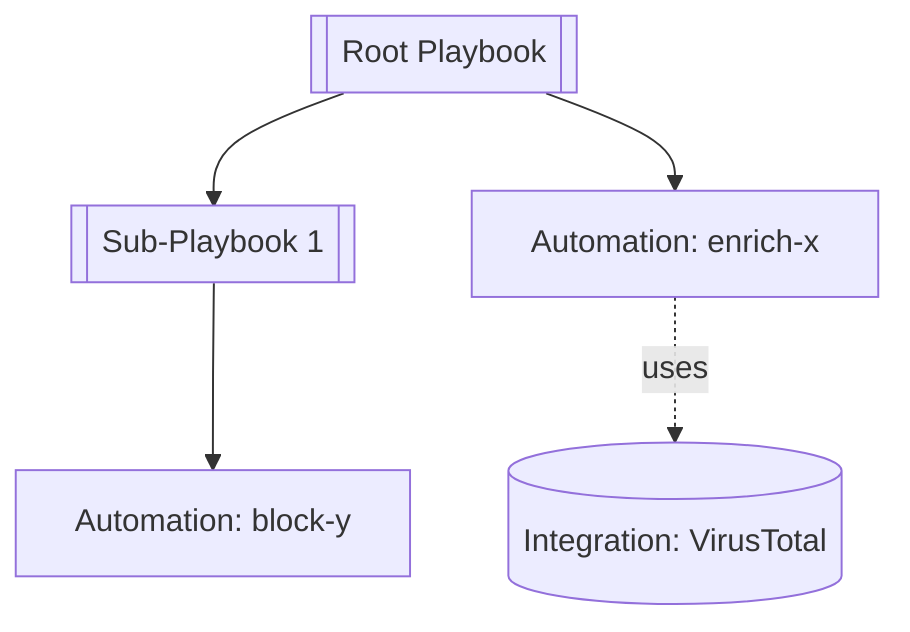

## Purpose

Documenting a playbook in isolation loses context. Sub-playbook behavior, automation error handling, and integration command details all affect how the root workflow actually operates. This skill produces a **linked document set** covering a playbook's entire dependency tree so the reader can navigate between components and so shared components are documented once and referenced from every consumer.

Output is written for a **mixed SOC audience**: XSOAR-fluent engineers plus analysts and managers who know the SOC but not the playbook editor. XSOAR terms are used throughout, and the first occurrence of each term links to a **glossary** that defines it and links to the relevant [Cortex XSOAR Playbook Design Guide](https://docs-cortex.paloaltonetworks.com/r/Cortex-XSOAR/6.x/Cortex-XSOAR-Playbook-Design-Guide/) page.

## When to Invoke

Trigger on: "workflow documentation", "full workflow", "comprehensive", "entire workflow", "document everything", "document the whole thing", "dependency tree", "document the workflow".

If the user asks for a single playbook, use `xsoar-playbook-documentation` instead. When in doubt, ask.

## Prerequisites

A manifest must exist at `investigation/docs/<sanitized-root-name>/manifest.json`, produced by:

```
python scripts/python/fetch-workflow.py --name "<root playbook name>"
```

The script recursively fetches every playbook in the tree, every referenced automation, every referenced integration (credentials stripped), and a one-shot incident-fields catalog used to resolve display names for fields the workflow actually uses. If the manifest is absent, run the fetch script first.

## Output Structure

```
investigation/docs/<root-sanitized>/
├── README.md                     # Workflow overview + runbook narrative
├── glossary.md                   # XSOAR concept definitions (mixed-audience support)
├── manifest.json                 # Produced by fetch-workflow.py
├── playbooks/
│   ├── <root>.md                 # Full deep-dive with per-task walkthrough
│   └── <sub-playbook>.md         # One per playbook in the tree
├── automations/
│   └── <automation>.md           # One per referenced automation
└── integrations/
    └── <integration>.md          # One per referenced integration
```

All filenames use `sanitize_filename()` (lowercase, hyphens, alphanumeric only) so cross-references are deterministic.

## Generation Order

Generate bottom-up so every link points to a file that already exists:

1. **Read `manifest.json`** — plan the work from the inventory.
2. **`glossary.md`** — define every XSOAR term the other docs will link to. Generate this first so all downstream links resolve.
3. **Integrations** — leaf dependencies; per-command reference tables.
4. **Automations** — may reference integrations.
5. **Per-playbook docs** — bottom-up (leaf sub-playbooks first, then callers). Apply the full per-playbook template below with cross-reference links.
6. **`README.md`** last — needs links to everything else, plus the runbook narrative.

## Concept-Link Convention

First use of each of these XSOAR terms in any doc links to the glossary; subsequent uses are plain text in the same doc:

- transformer, filter, sub-playbook, polling, context, indicator, incident field, task, conditional task, manual task, playbook input, playbook output, `continueonerror`, `separatecontext`, `reputationcalc`

Format: `[transformer](../glossary.md#transformer)` from per-playbook/automation/integration docs (one level deep); `[transformer](./glossary.md#transformer)` from the README. Keep the linking discipline tight — if every term on every line is a link, the doc becomes unreadable.

## Per-Playbook Doc Template

```markdown
← [Workflow Overview](../README.md) · [Glossary](../glossary.md)

# Playbook: <name>

- **Version:** <v> · **Start task:** <starttaskid>
- **Tasks:** <total> (<regular>, <condition>, <sub-playbook>, <manual>, <title>)
- **Called by:** <parent playbook links or "root">
- **Calls:** <N> sub-playbooks · <N> automations · <N> integrations

## 1. Overview
<2–4 sentences synthesizing the playbook's `description` field and what it actually achieves. If `description` is empty, infer from task names and note as inferred.>

## 2. Trigger & Inputs

**Triggered by:** <parent task link, or "root incident trigger" if this is the root>.

**Playbook inputs** (from `inputs[]`):

| Input | Source | Required | Description |
|-------|--------|----------|-------------|
| <name> | `${incident.X}` / `${inputs.Y}` / literal | ✓ / — | <description from the JSON> |

**Incident fields read:** list each entry in `incident_fields_referenced`, each linked to its glossary-level reference entry (see Incident Fields section of README).

## 3. Execution Flow (Diagram)

```mermaid
flowchart TD
  <nodes styled by task type — see Diagram Rules below>
```

## 4. Task-by-Task Walkthrough

Walk `starttaskid` → `nexttasks` in execution order. For every task in `tasks_by_id`, emit one subsection:

### Task <id> — <name>  `<type-badge>`

<1–3 sentence description from `task.description`; if empty, infer from `scriptName` + `scriptArguments` and prefix the sentence with "Inferred:">

**Arguments** (from `scriptArguments`; only if non-empty):

| Argument | Value | Resolved context refs | Transformers / Filters |
|----------|-------|----------------------|------------------------|
| <name> | <literal or `${path}`> | <when the value is a context ref, name the source> | <transformer chain if present> |

**Branches** (condition tasks only — from `conditions[]` and `nexttasks`):

| Branch label | Goes to |
|--------------|---------|
| <label or "#default#"> | Task <id> — <name> |

**Error path:** `continueonerror: <true/false>`. If true, name the fail branch (`nexttasks["#error#"]`). Flag with ⚠️ for reviewer attention.

**Outputs:** list context paths this task writes, derived from the automation's outputs schema when available. Link to the automation doc for the full output schema.

**Links:** if `type == "playbook"` → link to the sub-playbook doc. If `type == "regular"` and `scriptId` is an automation → link to the automation doc. If the task uses an integration command (`scriptId` contains `|||`) → link to the integration doc and anchor to the command subsection.

## 5. Decision Map

Every condition task in one table so reviewers can trace any path without reading the JSON:

| Task | Condition summary | Branches → next task |
|------|-------------------|----------------------|
| <id> — <name> | <one-line summary of what's being tested> | "yes" → <task>, "no" → <task>, "#default#" → <task> |

## 6. Manual & Collection Tasks

Every task with `type == "collection"` or a non-empty `form`. These are human intervention points — highlight them.

### Task <id> — <name>
- **Assigned to:** <role from `task.form.assignee` if present>
- **Questions:**
  | Label | Type | Options | Required |
  |-------|------|---------|----------|
  | <label> | <short/long text, multi-select, single-select> | <options if applicable> | ✓ / — |

## 7. Loops & Polling

Every task with a non-null `loop` config. For each:
- **Task:** <id> — <name>
- **Loop on:** <input expression>
- **Exit condition:** <from `loop.exit`>
- **Max iterations / timeout:** <if specified>
- **Polling indicator:** note if this is a `GenericPolling`-pattern (scriptName matches `*Polling*`).

## 8. Error-Handling Surface

Every task with `continueonerror: true`:

| Task | Task name | Fail branch destination |
|------|-----------|-------------------------|
| <id> | <name> | <target task or "(none — failure is swallowed)"> |

A row with "(none — failure is swallowed)" is a correctness concern — flag with ⚠️.

## 9. Outputs

What this playbook writes to context / emits on completion (from `outputs[]`):

| Output name | Context path | Description |
|-------------|--------------|-------------|

## 10. Dependencies
- **Sub-playbooks:** links to `./sanitized.md` for each. Unresolved sub-playbooks render as **bold text** with `(external / not fetched)`.
- **Automations:** links to `../automations/sanitized.md`.
- **Integrations:** links to `../integrations/sanitized.md`.
```

### Per-Playbook Diagram Rules

```mermaid
flowchart TD
  classDef regular fill:#e8f0fe,stroke:#4a6fa5
  classDef condition fill:#fff7e0,stroke:#c49b1d
  classDef manual fill:#ffe4e1,stroke:#b0413e
  classDef playbook fill:#e4f5e4,stroke:#2e7d32
  classDef title fill:#eee,stroke:#888,stroke-dasharray: 3 3
```

- Regular tasks → `classDef regular`
- Condition tasks → `classDef condition` (include the branch labels on outgoing edges)
- Manual / collection tasks → `classDef manual`
- Sub-playbook tasks → `classDef playbook`
- Title / section markers → `classDef title`
- Edge to `#error#` branch → dashed with label `on error`
- If total tasks > 40 → group by stage using `subgraph` blocks inferred from title tasks.

## Automation Doc Template

```markdown
← [Workflow Overview](../README.md) · [Glossary](../glossary.md)

# Automation: <name>

- **Type:** <type> / <subtype if present>
- **Docker image:** <dockerImage>
- **Run as:** <runAs> · **Run once:** <runOnce> · **Sensitive:** <sensitive>
- **Tags:** <tags>
- **Used by:** <N> playbooks / <M> task invocations

## Purpose
<From the `comment` field. If empty, infer from the name and the outputs' context paths, and prefix the paragraph with "Inferred:">

## Execution Environment
Brief block for ops readers: the container image, which user it runs as, whether concurrent invocations coalesce (`runOnce`), whether the script is marked sensitive (output not logged to war room).

## Arguments
| Name | Type | Required | Default | Description |
|------|------|----------|---------|-------------|

## Outputs
| Context Path | Type | Description |
|--------------|------|-------------|

## Invocation Sites
Every playbook task that calls this automation in the current workflow, from `manifest.automations[].invocations`:

| Playbook | Task | Arguments used |
|----------|------|----------------|
| [<playbook>](../playbooks/p.md) | <task id> — <task name> | `arg1=${incident.x}`, `arg2=...` |

If there are more than 10 invocations, show the top 10 with an "N more" note.

## Behavior Notes
One paragraph synthesized from `comment` + outputs. Cover: what it mutates in context (each output path), known error paths, any external calls (grep the comment / name for integration brands). If the script body was fetched, reference observable try/except blocks — do NOT paste source code into the doc.

## Dependencies
- Integrations invoked: links to `../integrations/*.md` (when the automation's code references integration brands — noted in the comment or inferred).
```

## Integration Doc Template

```markdown
← [Workflow Overview](../README.md) · [Glossary](../glossary.md)

# Integration: <brand>

- **Display name:** <display>
- **Category:** <category>
- **Version:** <version>
- **Used by:** <N> playbooks / <M> command invocations
- **Vendor docs:** search [docs-cortex.paloaltonetworks.com](https://docs-cortex.paloaltonetworks.com/) for "<brand>"

## Consumers
- Playbooks: [P1](../playbooks/p1.md), [P2](../playbooks/p2.md)
- Automations that invoke this integration (when known): [A1](../automations/a1.md)

## Commands Used in This Workflow

One subsection per command in `commands_used`, driven from `command_schemas[<command>]`:

### `<command-name>`

<description from the command schema>

**Arguments:**

| Name | Type | Required | Default | Secret | Description |
|------|------|----------|---------|--------|-------------|
| <name> | <type> | ✓ / — | <default> | 🔒 / — | <description> |

Type derived from: `isArray: true` → `array`; `predefined[]` non-empty → enum of listed values; otherwise `string`. The `secret: true` flag surfaces as 🔒 so analysts know which inputs are sensitive.

**Outputs:**

| Context Path | Type | Description |
|--------------|------|-------------|

**Invocation sites in this workflow** (from `manifest.integrations[].invocations` filtered by command):

| Playbook | Task | Arguments |
|----------|------|-----------|
| [P](../playbooks/p.md) | <task id> — <task name> | `arg=value` |

If deprecated (`command_schemas[cmd].deprecated: true`), prefix the subsection header with ⚠️ and note the deprecation.

## Full Command Inventory
Bulleted list of every entry in `available_commands`. Do not duplicate the schemas — only list command names with their description (one line each) so readers can see what's available but not used.

## Configuration Parameters
<Table of configuration parameters from the fetched JSON. Credentials are already redacted by the fetch script — include redacted rows with the `[REDACTED]` marker so the shape is visible, but do not re-expose any value.>

| Parameter | Type | Required | Description |
|-----------|------|----------|-------------|
```

## Workflow Overview / README Template

```markdown
# Workflow Documentation: <root playbook name>

Generated: <date> · Root: <name> · Version: <v>
Components: <N> playbooks · <N> automations · <N> integrations · <N> incident fields

## Table of Contents
- [Purpose](#purpose)
- [Runbook Narrative](#runbook-narrative)
- [Full Dependency Diagram](#full-dependency-diagram)
- [Components](#components)
- [Incident Fields Used](#incident-fields-used)
- [Cross-Reference Index](#cross-reference-index)
- [Glossary](./glossary.md)

## Purpose
<2–4 sentences synthesizing the root playbook's description and the role of the main sub-playbooks. Explain the workflow's overall job, not each component.>

## Runbook Narrative

**Headline content — this is what makes the doc a runbook, not a reference dump.** 3–5 paragraphs of prose synthesized by walking the root playbook's task graph:

- **Paragraph 1 — Trigger:** what kicks this workflow off (incident type, schedule, manual trigger), what inputs it expects, what it assumes about the incident state.
- **Paragraph 2 — Main phases:** one sentence per stage, anchored to the title tasks in the root playbook (or to sub-playbook boundaries if title tasks are absent). Link the first mention of each sub-playbook.
- **Paragraph 3 — Key decision points:** the most consequential condition tasks and what branches they lead to. Not every condition — just the ones that change the outcome materially (e.g. "is this a known false positive" vs. "enrich and escalate").
- **Paragraph 4 — Terminal outcomes:** what the workflow can end with (ticket created, indicator blocked, analyst handoff, auto-closed as FP). Map each to the tasks that produce it.
- **Paragraph 5 — Operator interventions & common failure modes:** where a human is asked to act (manual tasks, collection tasks), and where failures silently swallow via `continueonerror: true` without a recovery path.

**Generation rule:** produce one sentence per *significant* task, not every task. Significance heuristics:
- Sub-playbook tasks (always significant)
- Condition tasks whose branches diverge by ≥2 downstream tasks
- Manual/collection tasks
- Tasks with `continueonerror: true` whose fail branch is empty (silent-failure hazard)
- Terminal tasks (tasks with no `nexttasks`)

If the narrative is coming out as "Task 1 runs. Task 2 runs. Task 3 runs.", the walker is surfacing every task — re-filter against the heuristics above.

## Full Dependency Diagram

This is a **dependency graph**, not an execution flow. Execution flow lives in each playbook's own doc.



**Diagram conventions:**
- Playbooks → double-bordered rectangles `[[...]]`
- Automations → plain rectangles `[...]`
- Integrations → cylinders `[(...)]`
- Solid arrow → direct invocation
- Dashed arrow `-.uses.->` → integration command use

## Components

### Playbooks
| Playbook | Role | Called By | Tasks | Doc |
|----------|------|-----------|-------|-----|
| Root Name | Entry point | — | <N> | [full doc](./playbooks/root.md) |

### Automations
| Automation | Type | Docker | Used By | Invocations | Doc |
|------------|------|--------|---------|-------------|-----|

### Integrations
| Integration | Category | Commands used | Used By | Doc |
|-------------|----------|---------------|---------|-----|

## Incident Fields Used

Table driven from `manifest.workflow_incident_fields` joined against `reference_catalogs["incident-fields"]`:

| Field (CLI name) | Display name | Type | Read/Written by |
|------------------|--------------|------|-----------------|
| <cliName> | <display> | <type> | [Playbook](./playbooks/x.md) |

If `reference_catalogs["incident-fields"].status == "unauthorized"`, render the table with just `cliName` + "(field definitions unavailable — API key lacks `/incidentfields` access)" and skip the display/type columns. No broken links.

## Cross-Reference Index

**Shared automations** (invoked from ≥2 playbooks):
- [enrich-x](./automations/enrich-x.md) — Root, Sub 1, Sub 2

**Shared integrations** (used from ≥2 playbooks):
- [VirusTotal](./integrations/virustotal.md) — Root, Sub 1

**Error-tolerant tasks** (`continueonerror: true`):
- Root → Task 8 (Enrich Indicator)
- ⚠️ Sub 1 → Task 3 (Block URL) — no fail branch defined

**Manual / collection tasks** (require human action):
- Root → Task 12 (Analyst Review)

**Polling tasks:**
- Root → Task 5 (GenericPolling — Job Status)
```

## Glossary Template (`glossary.md`)

```markdown
# XSOAR Concepts Used in This Workflow

Quick definitions for readers new to XSOAR. Linked from first occurrence in every other doc in this folder.

## transformer
A function applied to a task's input or output value to reshape it (e.g. `toUpperCase`, `Cut`, `Stringify`). See [Filters and Transformers](https://docs-cortex.paloaltonetworks.com/r/Cortex-XSOAR/6.x/Cortex-XSOAR-Playbook-Design-Guide/Filters-and-Transformers).

## filter
A predicate applied to task input to narrow the values passed to the task (e.g. only IPs matching a CIDR). See [Filters and Transformers](https://docs-cortex.paloaltonetworks.com/r/Cortex-XSOAR/6.x/Cortex-XSOAR-Playbook-Design-Guide/Filters-and-Transformers).

## sub-playbook
A playbook called from another playbook as a single task. Enables composition and reuse. See [Sub-Playbooks](https://docs-cortex.paloaltonetworks.com/r/Cortex-XSOAR/6.x/Cortex-XSOAR-Playbook-Design-Guide/Sub-Playbooks).

## polling
A pattern (usually via `GenericPolling`) where a task re-runs on an interval until a condition is met, rather than blocking with a `Sleep`. See [Polling](https://docs-cortex.paloaltonetworks.com/r/Cortex-XSOAR/6.x/Cortex-XSOAR-Playbook-Design-Guide/Playbook-Polling).

## context
The shared JSON object that persists across all tasks in an incident. Task outputs write to context paths (e.g. `Indicator.Value`); subsequent tasks read via `${path}`.

## indicator
An atomic IOC (IP, URL, hash, domain, etc.) tracked by XSOAR and enriched by threat intel integrations. See [Indicators](https://docs-cortex.paloaltonetworks.com/r/Cortex-XSOAR/6.x/Cortex-XSOAR-Playbook-Design-Guide/Reputation-Commands-and-Indicators).

## incident field
A named slot on an incident (severity, owner, custom fields). Read with `${incident.fieldName}`.

## task
A single node in a playbook graph. Types: regular (runs an automation or integration command), condition, playbook (runs a sub-playbook), manual, collection, title.

## conditional task
A task whose outgoing edges depend on evaluating one or more conditions against context values. See [Conditional Tasks](https://docs-cortex.paloaltonetworks.com/r/Cortex-XSOAR/6.x/Cortex-XSOAR-Playbook-Design-Guide/Conditional-Tasks).

## manual task
A task that pauses the playbook until a human responds. Includes "collection" tasks (data gathering forms). See [Manual Tasks](https://docs-cortex.paloaltonetworks.com/r/Cortex-XSOAR/6.x/Cortex-XSOAR-Playbook-Design-Guide/Ad-Hoc-Task-Creation).

## playbook input
A named parameter the playbook accepts when invoked (usually from a parent playbook). Declared in the playbook's `inputs[]` array.

## playbook output
A named value the playbook writes back to the parent on completion. Declared in the playbook's `outputs[]` array.

## continueonerror
A boolean on a task that, when true, lets the playbook proceed even if the task fails. Without a fail-branch (`nexttasks["#error#"]`), failures are silently swallowed.

## separatecontext
A boolean on a sub-playbook task that isolates the sub-playbook's context from the parent. Protects the parent's context but means output mapping must be explicit. See [Sub-Playbooks — Context](https://docs-cortex.paloaltonetworks.com/r/Cortex-XSOAR/6.x/Cortex-XSOAR-Playbook-Design-Guide/Sub-Playbooks).

## reputationcalc
Controls how indicator reputation is aggregated across tasks (max severity vs. last-write-wins). See [Reputation Commands](https://docs-cortex.paloaltonetworks.com/r/Cortex-XSOAR/6.x/Cortex-XSOAR-Playbook-Design-Guide/Reputation-Commands-and-Indicators).
```

The glossary is generated from a **fixed** template — don't let the model invent definitions. If a term beyond this list shows up in docs and needs defining, add it to this file rather than inlining a definition.

## Cross-Reference Link Rules

- All inter-document links are **relative** (`./`, `../`) so the folder is portable (zip, upload, share).
- Filenames use `sanitize_filename(name)` — match the fetch script exactly.
- Components **not in manifest** (e.g., Builtin operations, external playbooks not fetched) render as **bold text** with `(not documented — builtin/external)`, not as a broken link.
- Reference-catalog miss (`reference_catalogs["incident-fields"].status != "fetched"`): render referenced incident fields as plain text (cliName only) with a small note, never as a broken link.
- Broken links are not acceptable output. Before finishing, scan generated docs and verify every `.md` link resolves to a file in the output folder.

## Dependency Diagram Generation (README)

From the manifest:

1. Start with `graph TD`.
2. Node per playbook from `manifest.playbooks` — double-bordered. Use `name` for label, `id` for node key.
3. Node per automation from `manifest.automations` — plain rectangle.
4. Node per integration from `manifest.integrations` — cylinder. Use `brand` for label/key.
5. Edges per playbook: to each `sub_playbooks[].id`, each `automations[].id`, each `integrations[].brand`.
6. Keep labels short. Confluence-rendered mermaid fails on long labels.
7. If total nodes > 40, group by layer: `subgraph Playbooks ... end`, `subgraph Automations ... end`, `subgraph Integrations ... end`.

## Manifest Schema Reference

Fields the doc generator relies on:

**Top-level:**
- `playbooks[]`, `automations[]`, `integrations[]`
- `workflow_incident_fields` — sorted list of `${incident.X}` names referenced anywhere in the tree.
- `workflow_indicator_fields` — same for `${indicator.X}`.
- `reference_catalogs` — `{"incident-fields": {"status": "...", "file": "...", "count": N}}`.

**Per playbook (`playbooks[]`):**
- `id`, `name`, `file`, `parents`, `starttaskid`, `inputs[]`, `outputs[]`
- `type_counts` — `{regular: N, condition: N, playbook: N, ...}` for the overview header.
- `incident_fields_referenced`, `indicator_fields_referenced`
- `tasks_by_id` — per-task profile for the task-by-task walkthrough (id, name, type, description, scriptArguments, conditions, fieldMapping, loop, form, nexttasks, continueonerror, reputationcalc, separatecontext)
- `sub_playbooks[]`, `automations[]`, `integrations[]` — dependency lists for the diagram and dependency section.

**Per automation (`automations[]`):**
- `id`, `name`, `file`, `status`, `used_by_playbooks`
- `invocations[]` — one entry per calling task: `{playbook, playbook_id, task_id, task_name, arguments}`.
- `type`, `subtype`, `dockerImage`, `runOnce`, `runAs`, `sensitive`, `tags`, `comment`.

**Per integration (`integrations[]`):**
- `brand`, `name`, `display`, `category`, `version`, `file`, `status`, `used_by_playbooks`
- `commands_used[]` — commands actually invoked in this workflow.
- `available_commands[]` — everything the integration exposes (from `integrationScript.commands`).
- `command_schemas` — `{<command>: {description, arguments[], outputs[], deprecated}}` for each entry in `commands_used`. This is the content source for the per-command subsections.
- `invocations[]` — one entry per calling task, including the specific `command` invoked.

## Special Cases

- **Components missing from manifest**: list them in the component tables with status "not fetched — missing from manifest". Do not link.
- **Credential-stripped fields**: integration config may show `[REDACTED]` or `[REDACTED - hidden field]`. Include those rows in the config table with the redacted marker — do not omit them, since their existence is part of the integration's shape.
- **Large trees (50+ components)**: the README components tables can get long. Add a note at the top: "This workflow has N components. Use the TOC or Ctrl-F." Do not truncate tables.
- **Long invocation lists on shared components**: if an automation or integration command has >10 invocations, show the top 10 by task occurrence order and add "+N more invocations" with the full list collapsed below (use a `<details>` block).
- **Cycles**: fetch-workflow.py handles cycles via visited-set. If a playbook appears as its own descendant in the manifest `parents` arrays, note it in the Cross-Reference Index under a "Circular references" subheading.
- **Reference-catalog unauthorized**: when `reference_catalogs[*].status == "unauthorized"`, degrade gracefully — the "Incident Fields Used" table falls back to CLI names only, and per-playbook "Incident fields read" lists render as plain text instead of links.

## Data Security

Same rules as the other XSOAR skills:
- No incident data, war room entries, evidence, or real indicator values.
- Do not re-expose anything the fetch script redacted.
- Do not output API keys, passwords, tokens, or hidden config fields.
- Do not paste automation source code into the doc — reference behaviour, don't reproduce code.
- If you encounter a field you suspect should have been redacted but wasn't, flag it to the user in chat and omit it from the doc.
